# iOS Offline-First Framework

```
   ____  ______ ______ __    _____   __ ______
  / __ \/ ____// ____// /   /  _/ | / // ____/
 / / / / /_   / /_   / /    / / /  |/ // __/   
/ /_/ / __/  / __/  / /____/ / / /|  // /___   
\____/_/    /_/    /_____/___//_/ |_//_____/   
                                               
    ███████╗██╗██████╗ ███████╗████████╗
    ██╔════╝██║██╔══██╗██╔════╝╚══██╔══╝
    █████╗  ██║██████╔╝███████╗   ██║   
    ██╔══╝  ██║██╔══██╗╚════██║   ██║   
    ██║     ██║██║  ██║███████║   ██║   
    ╚═╝     ╚═╝╚═╝  ╚═╝╚══════╝   ╚═╝   
         Work Offline. Sync Later.
```

<p align="center">
  <a href="https://swift.org"></a>
  <a href="https://developer.apple.com/ios/"></a>
  <a href="https://swift.org/package-manager/"></a>
  <a href="LICENSE"></a>
  
</p>

<p align="center">
  <b>The most comprehensive offline-first framework for iOS. Production-ready with CRDT support, real encryption, delta sync, and multi-device collaboration.</b>
</p>

<p align="center">
  <a href="#features">Features</a> •
  <a href="#installation">Installation</a> •
  <a href="#quick-start">Quick Start</a> •
  <a href="#architecture">Architecture</a> •
  <a href="Documentation/">Docs</a>
</p>

---

## 🚀 What's New in 2.0

- **CRDT Support** - Conflict-free replicated data types for automatic conflict resolution
- **Real Encryption** - AES-256-GCM & ChaCha20-Poly1305 with secure key management
- **Delta Sync** - Only sync what changed, save bandwidth
- **Multi-Device Sync** - Real-time collaboration across all your devices
- **Bandwidth Optimization** - Adaptive chunking and smart queue management
- **Background Sync** - BGTaskScheduler integration for reliable background updates
- **Optimistic UI** - Instant UI updates with automatic rollback on failure

---

## 📋 Table of Contents

- [Features](#-features)
- [Installation](#installation)
- [Quick Start](#quick-start)
- [Architecture](#architecture)
- [Core Components](#-core-components)
- [Advanced Features](#-advanced-features)
- [Documentation](#documentation)
- [Contributing](#contributing)
- [License](#license)

---

## Why Offline-First?

Users expect apps to work everywhere — in subways, airplanes, rural areas, or during network outages. Offline-first isn't just a feature; it's a **user expectation**.

```
┌─────────────────────────────────────────────────────────────┐
│  "The best user experience is one that works, period."      │
│                                        — Every User Ever    │
└─────────────────────────────────────────────────────────────┘
```

---

## ✨ Features

### Core Capabilities

| Feature | Description | Status |
|---------|-------------|--------|
| 💾 **Local Storage** | Encrypted file-based persistence | ✅ |
| 🔄 **Auto Sync** | Background synchronization with BGTaskScheduler | ✅ |
| ⚔️ **Conflict Resolution** | CRDT-based automatic resolution | ✅ |
| 📋 **Retry Queue** | Exponential backoff with persistence | ✅ |
| 📡 **Network Monitor** | Real-time connectivity & quality detection | ✅ |
| 🔐 **Encryption** | AES-256-GCM at-rest encryption | ✅ |
| 🗜️ **Compression** | LZ4/ZLIB/LZMA/LZFSE compression | ✅ |
| 📊 **Delta Sync** | Efficient change-only synchronization | ✅ |
| 📱 **Multi-Device** | Real-time cross-device sync | ✅ |
| ⚡ **Optimistic UI** | Instant updates with auto-rollback | ✅ |
| 📶 **Bandwidth Optimizer** | Adaptive transfer management | ✅ |

### Conflict Resolution Strategies

```
┌─────────────────────────────────────────────────────────────┐
│                  Conflict Resolution                         │
├─────────────────┬───────────────────────────────────────────┤
│  Last Write     │  Most recent timestamp wins               │
├─────────────────┼───────────────────────────────────────────┤
│  Server Wins    │  Remote data always takes precedence      │
├─────────────────┼───────────────────────────────────────────┤
│  Client Wins    │  Local changes always take precedence     │
├─────────────────┼───────────────────────────────────────────┤
│  Custom Merge   │  Your logic decides the outcome           │
├─────────────────┼───────────────────────────────────────────┤
│  CRDT           │  Automatic conflict-free merging          │
└─────────────────┴───────────────────────────────────────────┘
```

---

## Architecture

```mermaid
graph TD
    A[👤 User Action] --> B{📡 Network?}
    B -->|Online| C[🌐 Remote API]
    B -->|Offline| D[💾 Local Store]
    C --> E[⬇️ Sync to Local]
    D --> F[📋 Queue Operation]
    F --> G{📡 Back Online?}
    G -->|Yes| H[⬆️ Process Queue]
    H --> I[🔄 Delta Sync]
    I --> C
    E --> J[✅ Data Available]
    D --> J
    
    style A fill:#4CAF50,color:#fff
    style B fill:#FF9800,color:#fff
    style C fill:#2196F3,color:#fff
    style D fill:#9C27B0,color:#fff
    style J fill:#4CAF50,color:#fff
```



### System Components

```
┌─────────────────────────────────────────────────────────────────────────┐
│                        OfflineFirst Framework                            │
├─────────────────────────────────────────────────────────────────────────┤
│  ┌─────────────┐  ┌─────────────┐  ┌─────────────┐  ┌─────────────┐   │
│  │    CRDT     │  │  Encryption │  │ Compression │  │ Delta Sync  │   │
│  │   Engine    │  │   Engine    │  │   Engine    │  │   Engine    │   │
│  └─────────────┘  └─────────────┘  └─────────────┘  └─────────────┘   │
├─────────────────────────────────────────────────────────────────────────┤
│  ┌─────────────┐  ┌─────────────┐  ┌─────────────┐  ┌─────────────┐   │
│  │   Retry     │  │  Background │  │  Bandwidth  │  │ Multi-Device│   │
│  │   Queue     │  │    Sync     │  │  Optimizer  │  │    Sync     │   │
│  └─────────────┘  └─────────────┘  └─────────────┘  └─────────────┘   │
├─────────────────────────────────────────────────────────────────────────┤
│  ┌─────────────┐  ┌─────────────┐  ┌─────────────┐  ┌─────────────┐   │
│  │  Optimistic │  │   Network   │  │   Storage   │  │  Analytics  │   │
│  │     UI      │  │   Monitor   │  │   Manager   │  │   Manager   │   │
│  └─────────────┘  └─────────────┘  └─────────────┘  └─────────────┘   │
└─────────────────────────────────────────────────────────────────────────┘
```

---

## Installation

### Swift Package Manager

```swift
dependencies: [
    .package(
        url: "https://github.com/Nahodan/iOS-Offline-First-Framework.git",
        from: "2.0.0"
    )
]
```

Then import:

```swift
import OfflineFirstFramework
```

---

## Quick Start

### 1. Initialize the Framework

```swift
import OfflineFirstFramework

// Initialize with default configuration
let offlineManager = OfflineFirstManager.shared
offlineManager.initialize(with: OfflineFirstConfiguration())
```

### 2. Define Your Model

```swift
struct Task: Syncable {
    let id: String
    var title: String
    var isCompleted: Bool
    var lastModified: Date
    var version: Int64
    var isDirty: Bool
    
    var syncId: String { id }
}
```

### 3. Save Data (Works Offline!)

```swift
let task = Task(
    id: UUID().uuidString,
    title: "Buy groceries",
    isCompleted: false,
    lastModified: Date(),
    version: 1,
    isDirty: true
)

// Saves locally, queues for sync if offline
offlineManager.save(task)
    .subscribe(onNext: { result in
        print("Saved: \(result)")
    })
    .disposed(by: disposeBag)
```

### 4. Monitor Sync Status

```swift
offlineManager.syncStatus
    .subscribe(onNext: { status in
        switch status {
        case .idle:
            print("Ready to sync")
        case .inProgress:
            print("Syncing...")
        case .completed:
            print("Sync complete!")
        case .failed(let error):
            print("Sync failed: \(error)")
        }
    })
    .disposed(by: disposeBag)
```

---

## 🔧 Core Components

### CRDT Types

Conflict-free Replicated Data Types for automatic merge:

```swift
// Last-Writer-Wins Register
var counter = LWWRegister(value: "Hello", nodeId: deviceId)
counter = counter.update("World")

// OR-Set (add/remove support)
var set = ORSet<String>(nodeId: deviceId)
set = set.add("item1")
set = set.remove("item1")

// PN-Counter (increment/decrement)
var visits = PNCounter(nodeId: deviceId)
visits = visits.increment()
visits = visits.decrement()

// Merge with remote
let merged = counter.merge(with: remoteCounter)
```

### Encryption

Production-ready encryption with CryptoKit:

```swift
let encryption = EncryptionEngine()

// Encrypt with master key
let encrypted = try encryption.encrypt(data)

// Decrypt
let decrypted = try encryption.decrypt(encrypted)

// Password-based encryption
let encryptedWithPassword = try encryption.encrypt(data, password: "secret")
```

### Compression

Multiple algorithms with adaptive selection:

```swift
let compression = CompressionEngine(configuration: .default)

// Compress
let compressed = try compression.compress(data)
print("Ratio: \(compressed.compressionRatio)")

// Decompress
let original = try compression.decompress(compressed)
```

### Delta Sync

Only sync what changed:

```swift
let deltaEngine = DeltaSyncEngine()

// Detect changes
let change = try await deltaEngine.detectChanges(
    old: oldTask,
    new: newTask,
    entityType: "Task"
)

// Apply patch
let patched = try await deltaEngine.applyPatch(change.patch!, to: oldTask)
```

### Retry Queue

Persistent queue with exponential backoff:

```swift
let queue = RetryQueue(configuration: .default)

// Queue operation
let operation = OperationBuilder()
    .type(.update)
    .entity(id: "123", type: "Task")
    .payload(try JSONEncoder().encode(task))
    .priority(.high)
    .build()

await queue.enqueue(operation)

// Monitor progress
queue.statusPublisher
    .sink { status in
        print("Pending: \(status.pendingCount)")
    }
    .store(in: &cancellables)
```

### Background Sync

Reliable background updates with BGTaskScheduler:

```swift
// In AppDelegate
let scheduler = BackgroundSyncScheduler()
scheduler.registerBackgroundTask()
scheduler.setSyncHandler(DefaultSyncHandler(retryQueue: queue))
scheduler.enable()

// Check last sync
if let result = scheduler.lastSyncResult {
    print("Last sync: \(result.itemsSynced) items")
}
```

### Optimistic UI

Instant updates with auto-rollback:

```swift
let store = ObservableEntityStore<Task>()
let optimistic = OptimisticUpdateManager(store: store)

// Update with instant UI feedback
optimistic.optimisticUpdate(updatedTask) {
    try await api.update(updatedTask)
}

// SwiftUI support
TaskRow(task: task)
    .pendingOverlay(optimistic.isPending(entityId: task.id))
```

### Multi-Device Sync

Real-time collaboration:

```swift
let multiDevice = MultiDeviceSyncManager(
    configuration: .default(deviceName: UIDevice.current.name)
)

multiDevice.start()

// Send changes to all devices
try await multiDevice.sendDelta(changes)

// Handle incoming changes
multiDevice.setMessageHandler { message in
    // Process sync message
}

// Monitor connected devices
multiDevice.devicesPublisher
    .sink { devices in
        print("Connected: \(devices.count) devices")
    }
    .store(in: &cancellables)
```

### Bandwidth Optimizer

Smart transfer management:

```swift
let bandwidth = BandwidthOptimizer(configuration: .default)

// Queue transfer
let taskId = await bandwidth.queueTransfer(
    TransferTask(type: .upload, dataSize: fileSize, priority: .normal)
)

// Monitor network quality
bandwidth.qualityPublisher
    .sink { quality in
        if quality.isPoor {
            print("Poor connection - deferring large syncs")
        }
    }
    .store(in: &cancellables)

// Check if should defer
if await bandwidth.shouldDeferSync(priority: .low) {
    // Wait for better connection
}
```

---

## 📚 Advanced Features

### Custom Conflict Resolution

```swift
let engine = ConflictResolutionManager()

// Detect conflicts
let conflicts = engine.detectConflicts(local: localTask, remote: remoteTask)

// Custom resolution
engine.autoResolveConflicts(conflicts, strategy: .custom { local, remote in
    // Your merge logic
    var merged = remote
    merged.localNotes = local.localNotes
    return merged
})
```

### Network Quality Monitoring

```swift
let networkMonitor = NetworkStateManager()

networkMonitor.isOnline
    .distinctUntilChanged()
    .subscribe(onNext: { isOnline in
        if isOnline {
            syncEngine.syncNow()
        }
    })
    .disposed(by: disposeBag)
```

---

## Requirements

| Requirement | Version |
|-------------|---------|
| iOS | 15.0+ |
| macOS | 12.0+ |
| tvOS | 15.0+ |
| watchOS | 8.0+ |
| Xcode | 15.0+ |
| Swift | 5.9+ |

---

## Documentation

Detailed documentation available in [Documentation/](Documentation/):

- [Getting Started](Documentation/GettingStarted.md)
- [CRDT Guide](Documentation/CRDT.md)
- [Encryption](Documentation/Encryption.md)
- [Delta Sync](Documentation/DeltaSync.md)
- [Background Sync](Documentation/BackgroundSync.md)
- [Multi-Device](Documentation/MultiDevice.md)
- [Migration Guide](Documentation/Migration.md)

---

## Contributing

Contributions are welcome! Please read the [Contributing Guide](CONTRIBUTING.md) first.

1. Fork the repo
2. Create your feature branch (`git checkout -b feature/amazing-feature`)
3. Commit your changes (`git commit -m 'feat: add amazing feature'`)
4. Push to the branch (`git push origin feature/amazing-feature`)
5. Open a Pull Request

---

## License

This project is licensed under the MIT License — see the [LICENSE](LICENSE) file for details.

---

## Author

**Muhittin Camdali** — [@Nahodan](https://github.com/Nahodan)

---

<p align="center">
  <sub>Built with ❤️ for apps that work everywhere</sub>
</p>

---

## 📈 Star History

<a href="https://star-history.com/#Nahodan/iOS-Offline-First-Framework&Date">
 <picture>
   <source media="(prefers-color-scheme: dark)" srcset="https://api.star-history.com/svg?repos=Nahodan/iOS-Offline-First-Framework&type=Date&theme=dark" />
   <source media="(prefers-color-scheme: light)" srcset="https://api.star-history.com/svg?repos=Nahodan/iOS-Offline-First-Framework&type=Date" />
   
 </picture>
</a>
