# iOS Offline-First Framework

```
   ____  ______ ______ __    _____   __ ______
  / __ \/ ____// ____// /   /  _/ | / // ____/
 / / / / /_   / /_   / /    / / /  |/ // __/   
/ /_/ / __/  / __/  / /____/ / / /|  // /___   
\____/_/    /_/    /_____/___//_/ |_//_____/   
                                               
    ███████╗██╗██████╗ ███████╗████████╗
    ██╔════╝██║██╔══██╗██╔════╝╚══██╔══╝
    █████╗  ██║██████╔╝███████╗   ██║   
    ██╔══╝  ██║██╔══██╗╚════██║   ██║   
    ██║     ██║██║  ██║███████║   ██║   
    ╚═╝     ╚═╝╚═╝  ╚═╝╚══════╝   ╚═╝   
         Work Offline. Sync Later.
```

<p align="center">
  <a href="https://swift.org"></a>
  <a href="https://developer.apple.com/ios/"></a>
  <a href="https://swift.org/package-manager/"></a>
  <a href="LICENSE"></a>
  <a href="https://github.com/muhittincamdali/iOS-Offline-First-Framework/actions"></a>
</p>

<p align="center">
  <b>Build iOS apps that work seamlessly offline with automatic sync, conflict resolution, and persistent queues.</b>
</p>

<p align="center">
  <a href="#installation">Installation</a> •
  <a href="#quick-start">Quick Start</a> •
  <a href="#architecture">Architecture</a> •
  <a href="#features">Features</a> •
  <a href="Documentation/">Docs</a>
</p>

---

## Why Offline-First?

Users expect apps to work everywhere — in subways, airplanes, rural areas, or during network outages. Offline-first isn't just a feature; it's a **user expectation**.

```
┌─────────────────────────────────────────────────────────────┐
│  "The best user experience is one that works, period."      │
│                                        — Every User Ever    │
└─────────────────────────────────────────────────────────────┘
```

## Architecture

```mermaid
graph TD
    A[👤 User Action] --> B{📡 Network?}
    B -->|Online| C[🌐 Remote API]
    B -->|Offline| D[💾 Local DB]
    C --> E[⬇️ Sync to Local]
    D --> F[📋 Queue for Sync]
    F --> G{📡 Back Online?}
    G -->|Yes| H[⬆️ Process Queue]
    H --> C
    E --> I[✅ Data Available]
    D --> I
    
    style A fill:#4CAF50,color:#fff
    style B fill:#FF9800,color:#fff
    style C fill:#2196F3,color:#fff
    style D fill:#9C27B0,color:#fff
    style I fill:#4CAF50,color:#fff
```



### Data Flow

```
┌──────────────┐     ┌──────────────┐     ┌──────────────┐
│   App Layer  │────▶│  Sync Engine │────▶│  Remote API  │
└──────────────┘     └──────┬───────┘     └──────────────┘
                           │
                           ▼
                    ┌──────────────┐
                    │  Local Store │
                    │  (CoreData)  │
                    └──────────────┘
```

## Features

| Feature | Description | Status |
|---------|-------------|--------|
| 💾 **Local Storage** | Core Data / SwiftData persistence | ✅ |
| 🔄 **Auto Sync** | Background synchronization when online | ✅ |
| ⚔️ **Conflict Resolution** | Multiple strategies (server-wins, client-wins, merge) | ✅ |
| 📋 **Operation Queue** | Offline actions queued with retry logic | ✅ |
| 📡 **Network Monitor** | Real-time connectivity detection | ✅ |
| 🔐 **Encryption** | Optional at-rest encryption | ✅ |
| 📊 **Sync Status** | Observable sync state and progress | ✅ |
| 🧪 **Testable** | Protocol-based design for easy mocking | ✅ |

### Conflict Resolution Strategies

```
┌─────────────────────────────────────────────────────────────┐
│                  Conflict Resolution                         │
├─────────────────┬───────────────────────────────────────────┤
│  Server Wins    │  Remote data always takes precedence      │
├─────────────────┼───────────────────────────────────────────┤
│  Client Wins    │  Local changes always take precedence     │
├─────────────────┼───────────────────────────────────────────┤
│  Last Write     │  Most recent timestamp wins               │
├─────────────────┼───────────────────────────────────────────┤
│  Custom Merge   │  Your logic decides the outcome           │
└─────────────────┴───────────────────────────────────────────┘
```

## Installation

### Swift Package Manager

```swift
dependencies: [
    .package(
        url: "https://github.com/muhittincamdali/iOS-Offline-First-Framework.git",
        from: "1.0.0"
    )
]
```

Then import:

```swift
import OfflineFirst
```

## Quick Start

### 1. Configure the Sync Engine

```swift
import OfflineFirst

// Initialize with your storage and API
let syncEngine = SyncEngine(
    localStore: CoreDataStorage(modelName: "MyApp"),
    remoteAPI: MyAPIService(),
    conflictStrategy: .lastWriteWins
)

// Start monitoring
syncEngine.startMonitoring()
```

### 2. Save Data (Works Offline!)

```swift
// Create and save — works with or without network
let user = User(name: "John", email: "john@example.com")

do {
    try await syncEngine.save(user)
    // Data saved locally, queued for sync if offline
} catch {
    print("Save failed: \(error)")
}
```

### 3. Fetch Data (Local-First)

```swift
// Always returns local data, syncs in background
let users: [User] = try await syncEngine.fetch(
    predicate: NSPredicate(format: "isActive == true"),
    sortBy: [NSSortDescriptor(key: "name", ascending: true)]
)
```

### 4. Monitor Sync Status

```swift
syncEngine.$syncState
    .sink { state in
        switch state {
        case .idle:
            hideLoadingIndicator()
        case .syncing(let progress):
            showProgress(progress)
        case .completed(let result):
            showSyncComplete(changes: result.changesCount)
        case .failed(let error):
            showSyncError(error)
        }
    }
    .store(in: &cancellables)
```

## Advanced Usage

### Custom Conflict Resolution

```swift
let engine = SyncEngine(
    localStore: storage,
    remoteAPI: api,
    conflictStrategy: .custom { local, remote in
        // Your merge logic
        if local.priority > remote.priority {
            return local
        }
        
        // Or merge fields
        var merged = remote
        merged.localNotes = local.localNotes
        return merged
    }
)
```

### Network Monitoring

```swift
let networkMonitor = NetworkMonitor()

networkMonitor.$isConnected
    .sink { isConnected in
        if isConnected {
            syncEngine.syncNow()
            hideOfflineBanner()
        } else {
            showOfflineBanner()
        }
    }
    .store(in: &cancellables)

// Check connection type
if networkMonitor.connectionType == .wifi {
    syncEngine.syncLargeFiles()
}
```

### Operation Queue

```swift
// Queue operations when offline
let operation = SyncOperation(
    type: .update,
    entity: "User",
    id: user.id,
    payload: user.encoded(),
    priority: .high,
    retryCount: 3
)

syncEngine.queue(operation)

// Check pending operations
let pendingCount = syncEngine.pendingOperationsCount
print("Waiting to sync: \(pendingCount) operations")
```

### Batch Sync

```swift
// Sync specific entities
try await syncEngine.sync(entities: [User.self, Post.self])

// Full sync
try await syncEngine.syncAll()

// Sync with options
try await syncEngine.sync(
    options: SyncOptions(
        batchSize: 50,
        conflictStrategy: .serverWins,
        timeout: 30
    )
)
```

## Example App

Check out the [Examples](Examples/) folder for a complete demo app showing:

- Offline-first todo list
- Background sync with progress
- Conflict resolution UI
- Network status handling

## Requirements

| Requirement | Version |
|-------------|---------|
| iOS | 15.0+ |
| macOS | 12.0+ |
| Xcode | 15.0+ |
| Swift | 5.9+ |

## Contributing

Contributions are welcome! Please read the [Contributing Guide](CONTRIBUTING.md) first.

1. Fork the repo
2. Create your feature branch (`git checkout -b feature/amazing-feature`)
3. Commit your changes (`git commit -m 'feat: add amazing feature'`)
4. Push to the branch (`git push origin feature/amazing-feature`)
5. Open a Pull Request

## License

This project is licensed under the MIT License — see the [LICENSE](LICENSE) file for details.

## Author

**Muhittin Camdali** — [@muhittincamdali](https://github.com/muhittincamdali)

---

<p align="center">
  <sub>Built with ❤️ for apps that work everywhere</sub>
</p>
